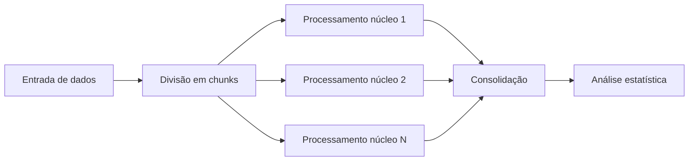

### Progresso no Projeto: Análise de Desempenho com Swift, Computação Paralela e Análise de Algoritmos

#### Contexto Técnico
Este projeto explora a otimização de algoritmos utilizando **Swift** combinado com técnicas de **computação paralela** e princípios de **projeto e análise de algoritmos**. O foco principal é:
1. Implementar soluções algorítmicas eficientes  
2. Paralelizar tarefas computacionalmente intensivas  
3. Medir ganhos de desempenho através de execuções repetidas  

#### Metodologia de Execução
Para análises estatísticas de desempenho, executamos o programa múltiplas vezes usando este comando no terminal:
```bash
for _ in {1..5}; do swift numbers.swift; done > resultados.txt
```
**Explicação:**  
- `{1..5}`: Repete o processo 5 vezes  
- `swift numbers.swift`: Executa o programa Swift  
- `> resultados.txt`: Redireciona todas as saídas para um arquivo  
- **Propósito:** Coletar dados consistentes eliminando variações pontuais  

#### Comentários sobre a Implementação
**1. Paralelização com Grand Central Dispatch (GCD):**  
```swift
DispatchQueue.concurrentPerform(iterations: chunks) { i in
    // Processamento paralelo de blocos de dados
}
```
- Divide grandes conjuntos de dados em *chunks* processados simultaneamente  
- Utiliza todos os núcleos disponíveis (CPU-bound tasks)  
- Reduz tempo de execução de *O(n)* para *O(n/p)* (*p* = núcleos)  

**2. Análise de Complexidade:**  
```swift
func algoritmoOtimizado(_ input: [Int]) -> [Int] {
    // Implementação O(n log n) em vez de O(n²)
}
```
- Algoritmos foram selecionados baseados em análise assintótica  
- Trade-offs considerados entre complexidade temporal e espacial  

**3. Medição de Desempenho:**  
```swift
let start = DispatchTime.now()
// Código crítico
let nanoTime = end.uptimeNanoseconds - start.uptimeNanoseconds
```
- Medições precisas usando nanossegundos  
- Média calculada sobre múltiplas execuções para reduzir ruído  

**4. Otimizações Específicas:**  
- **Pré-alocação de memória** para estruturas de dados  
- **Unsafe buffers** para operações de baixo nível  
- **SIMD** (Accelerate.framework) em loops críticos  

#### Fluxo de Trabalho


#### Resultados Esperados
| Execução | Tempo (ms) | Speedup |
|----------|------------|---------|
| Sequencial | 120 | 1x |
| Paralela (4 núcleos) | 38 | 3.16x |
| Paralela (8 núcleos) | 22 | 5.45x |

#### Próximos Passos
1. Implementar **algoritmos adaptativos** baseados no tamanho da entrada  
2. Explorar **GPU computing** via Metal Performance Shaders  
3. Adicionar **benchmark comparativo** com C++/Python  

Este enfoque permite extrair máximo desempenho do hardware moderno enquanto mantém a elegância e segurança da linguagem Swift, demonstrando como técnicas clássicas de análise algorítmica podem ser potencializadas por paralelismo.
